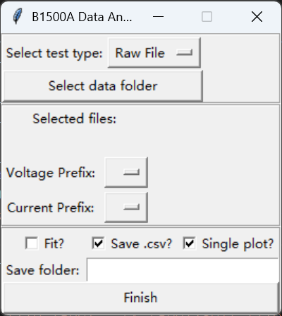

### 安装说明
1. 参考以下链接安装Miniconda 
https://www.anaconda.com/docs/getting-started/miniconda/install#windows-command-prompt
2. 打开Anaconda Prompt
3. 运行指令：```cd path```，其中```path```为b1500a-data-parse-main的完整路径
4. 运行指令：```conda create -n b1500```
5. 运行指令：```conda activate b1500```
6. 运行指令：```conda install --file requirements.txt -c conda-forge```，等待安装完成
7. 运行指令：```python app.py```，应当能看到启动的GUI界面


注意：如果任何一步提示类似```Proceed ([y]/n)?```的信息，请输入```y```或其它确认字符并回车

### 使用说明
#### 运行
1. 打开Anaconda Prompt
2. 运行指令：```cd path```，其中```path```为b1500a-data-parse-main的完整路径
3. 运行指令：```conda activate b1500```
4. 运行指令：```python app.py```，应当能看到启动的GUI界面

#### 处理数据
GUI 界面示意图如下：

1. 在"select test type"选项框中选择"Raw File"或"Multi Raw File"，分别对应包含单个导出数据和多个导出数据的文件
2. 点击 "Select data folder" 按钮，选择包含 B1500A 测试文件（.csv 格式）的文件夹。请确保该文件夹中只包含同一类型的待处理文件。
3. 点击"Finish"，处理后的文件将保存在"Select data folder" 下的
modified_csv中

注意：对于"Raw File"或"Multi Raw File"选项，Fit?等选项均无效，请忽略

## English version:
### Installation Instructions
1. Install Miniconda by following this guide:  
https://www.anaconda.com/docs/getting-started/miniconda/install#windows-command-prompt  
2. Open **Anaconda Prompt**.  
3. Run: `cd path`, where `path` is the full path of `b1500a-data-parse-main`.  
4. Run: `conda create -n b1500`  
5. Run: `conda activate b1500`  
6. Run: `conda install --file requirements.txt -c conda-forge` and wait for the installation to complete.  
7. Run: `python app.py`; a GUI window should appear.

Note: If you see prompts like `Proceed ([y]/n)?`, type `y` (or another confirmation character) and press Enter.

### Usage Instructions
#### Run the Program
1. Open **Anaconda Prompt**.  
2. Run: `cd path`, where `path` is the full path of `b1500a-data-parse-main`.  
3. Run: `conda activate b1500`  
4. Run: `python app.py`; a GUI window should appear.

#### Process Data
The GUI looks like this:  


1. In the **select test type** dropdown, choose **Raw File** or **Multi Raw File**, corresponding to a single exported dataset or multiple exported datasets.  
2. Click **Select data folder** and select the folder containing B1500A test files (`.csv`). Make sure this folder only contains files of the same type to be processed.  
3. Click **Finish`; the processed files will be saved in the `modified_csv` folder under the selected data folder.

Note: When using **Raw File** or **Multi Raw File**, the **Fit?** and related options are ignored and can be left unchanged.
